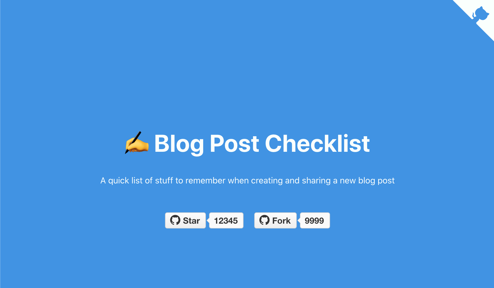
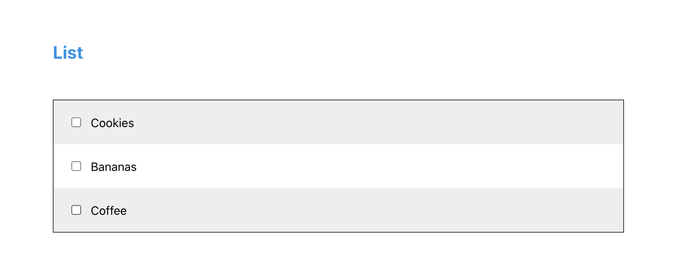

# Blog Post Checklist

> A quick list of stuff to remember when creating and sharing a new blog post

[Website](https://harrisgeo88.github.io/blog-post-checklist/)

## Installation and Setup Instructions

Installation:

`yarn install`

To Start Server:

`yarn start`

To Run TestSuite:

`yarn test`

To Visit App:

http://localhost:3000

## Adding your own items 🔥

The app will display your custom list items if you pass them as query string params. Separate each list item with a `,` (comma)

### Example

Adding `?items=cookies,bananas,coffee`

Will result in https://harrisgeo88.github.io/blog-post-checklist?items=cookies,bananas,coffee

